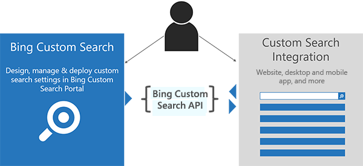

# What is the Bing Custom Search API?

The Bing Custom Search API enables you to create tailored ad-free search experiences for topics that you care about. You can specify the domains and webpages for Bing to search, as well as pin, boost, or demote specific content to create a custom view of the web and help your users quickly find relevant search results. 

## Features

|Feature  |Description  |
|---------|---------|
|[Custom real-time search suggestions](../bing-custom-autosuggest/overview.md)     | Provide search suggestions that can be displayed as a dropdown list as your users type.       | 
|[Custom image search experiences](../bing-custom-image-search/overview.md)     | Enable your users to search for images from the domains and websites specified in your custom search instance.        |        
|[Custom video search experiences](../bing-custom-video-search/overview.md)     | Enable your users to search for videos from the domains and sites specified in your custom search instance.        |    
|[Share your custom search instance](how-to/share-your-custom-search.md)     | Collaboratively edit and test your search instance by sharing it with members of your team.        | 
|[Configure a UI for your applications and websites](how-to/hosted-ui.md)     | Provides a hosted UI that you can easily integrate into your webpages and web applications as a JavaScript code snippet.        | 

## Workflow

You can create a customized search instance by using the [Bing Custom Search portal](https://customsearch.ai). The portal enables you to create a custom search instance that specifies the domains, websites, and webpages that you want Bing to search, along with the ones that you don’t want it to search. You can also use the portal to: preview the search experience, adjust the search rankings that the API provides, and optionally configure a searchable user interface to be rendered in your websites and applications.

After creating your search instance, you can integrate it (and optionally, a user interface) into your website or application by calling the Bing Custom Search API:

## Next steps

To get started quickly, see [Create your first Bing Custom Search instance](how-to/quick-start.md).

For details about customizing your search instance, see [Define a custom search instance](how-to/define-your-custom-view.md).

Be sure to read [Bing Use and Display Requirements](../bing-web-search/use-display-requirements.md) for using search results in your services and applications.

Familiarize yourself with the reference content for each of the custom search endpoints. The reference contains the endpoints, headers, and query parameters that you'd use to request search results. It also includes definitions of the response objects.

[!INCLUDE [bing-url-note](../../includes/bing-url-note.md)]

- [Custom Search API](reference/endpoints.md)
- [Custom Image API](../bing-custom-image-search/reference/endpoints.md)
- [Custom Video API](../bing-custom-video-search/reference/endpoints.md)
- [Custom Autosuggest API](../bing-custom-autosuggest/reference/endpoints.md)

